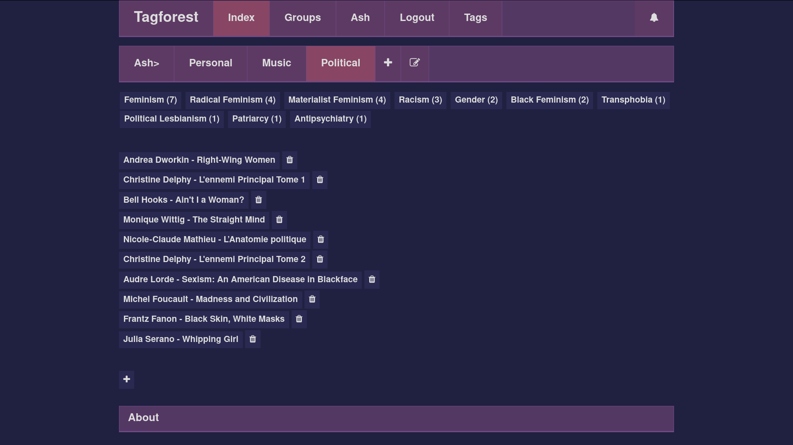
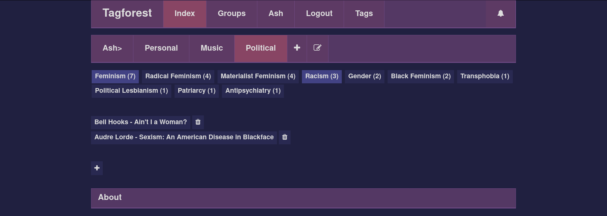

# Tagforest website source code

## Description

Django website to share and organize knowledge and ressources by classifying them with tags
[Website link](www.tagforest.fr)

## Goals

- Track, classify, take notes of ressources you've read / seen from different subjects in one place
- Visualize them in one place, and share a set of knowledge from a subject to others with one link
- Create groups to collaboratively organize ressources together
- [In Progress] Visualize the different categories / movements and the way they connect to each other
- [In Progress] Merge your set of ressources and categories with someone else, or see what ressources
  you have in common

## Accessibility, Privacy, Security, Content

- [In Progress] Website accessibility:
   * should be as accessible as possible to disabled people
   * should be as easy as possible to understand

## Current state

**v1.3 (2020/07/09)**

Usage example: 

- User authentification system
- Groups, Trees, Entries and Tags:
  * A group contains multiple users
  * Trees can be added to a group
  * A tree contains a list of entries and tags
  * Each entry can have multiple tags
  * In a tree, entries can be sorted by tags, and tags are sorted by entry count
  * An entry can contain markdown formatted text, and the markdown is rendered when viewing it

## Upcoming:

- Tag name fuzzyness: each tag has a set of names which will be considered to lead to the same tag
- Directed Acyclic Graph (DAG) of tags: tags are related to each other through a DAG
- More fields for each entry, and different types of tags
- Multiple color schemes

## Run a local version of the website

- Install Django (installing it in a virtual environnement is a good way to do it, using virtualenvwrapper for instance)
- Install mariadb, and setup a database called "tagforest" with the right configuration according to the databases section in the settings.py file
- Clone the git project, make the migrations with `python manage.py migrate`
- Install sass, and compile scss files by executing `sass scss:static/tags` at the root of the project
- Execute `python manage.py runserver`, and go to http://localhost:8000/

## Tools / Languages / Frameworks used

### Website developpment:
  - Languages: **Python 3, HTML, CSS, Javascript**
  - [Django](https://www.djangoproject.com/): main framework, django modules used: django-notifications-hq, django-dag (upcoming)</li>
  - [VueJS](https://vuejs.org/): for small javascript apps throughout the website, vue modules used: vue-markdown, vue-click-outside</li>
  - [Sass](https://sass-lang.com/): CSS preprocessing</li>

## Git workflow

feature git workflow is used:

- Nothing is commited directly to master and dev, and these branches are never rebased
- All other branches are rebased before each merge to ensure a clean history, and to ensure
everything compiles at each commit
- Other branches are either feature branches, hotfix or release, and end up being merged to dev
- Commits are in english and imperative
- Each merge to master is tagged as a new version
